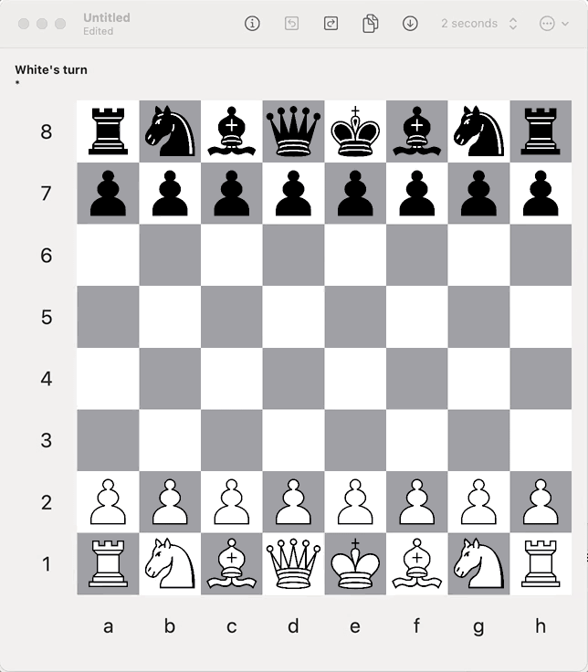

#  BChess

BChess is an open-source chess engine written in C++ and SwiftUI. The main goal was to write a C++ chess engine using bitboard representation. SwiftUI was used to write the UI in a concise and portable manner. Warning: the application is not yet fully complete - see the list of things to be done below.

Enjoy!

## Features

- Supports all chess rules (including "en passant" and pawn promotion)
- C++ chess engine supporting multiple level of difficulty (timed)
- User interface written in SwiftUI, supporting macOS and iOS

## Attributions
- [SwiftUI animation completion](https://www.avanderlee.com/swiftui/withanimation-completion-callback/)
- [Magic Move-Bitboard Generation in Computer Chess, Pradyumna Kannan](http://pradu.us/old/Nov27_2008/Buzz/research/magic/Bitboards.pdf)
- [Magic Move-Bitboard Generation Source Code](https://essays.jwatzman.org/essays/chess-move-generation-with-magic-bitboards.html)
- [Chess Evaluation](https://chessprogramming.wikispaces.com/Evaluation)

##  What remains to be done

- Filter saving PGN to 80 characters per line
- Finish Zobrist hashing unit test with all the scenarios: castling, attack, etc.
- Ensure that when a Game is copied, the history is also copied, not just referenced because it will get messed up (see FEngineInfo)
- Better handling of openings when a FEN is passed (and the board is not in the expected state for the opening)
- Handle UCI move with promotion (for example h1b1q)
- Time management in UCI
- Add 3 fold repetition rule
- Add 50 moves rule
- Add heuristic to add bonus when king is safely behind its raw of pawns after castling
- Add more openings
- Transposition table [here](http://www.chessbin.com/post/Transposition-Table-and-Zobrist-Hashing) and [here](https://chessprogramming.wikispaces.com/Transposition+Table)
- [Optimization](https://people.cs.clemson.edu/~dhouse/courses/405/papers/optimize.pdf)

## Limitations

- unable to have read-only document (it always want to write it back)
- background of List is not transparent in Light Mode (it is white)
- unable to create rich text with support of tapping in it (like to select precisely the white or black move)

