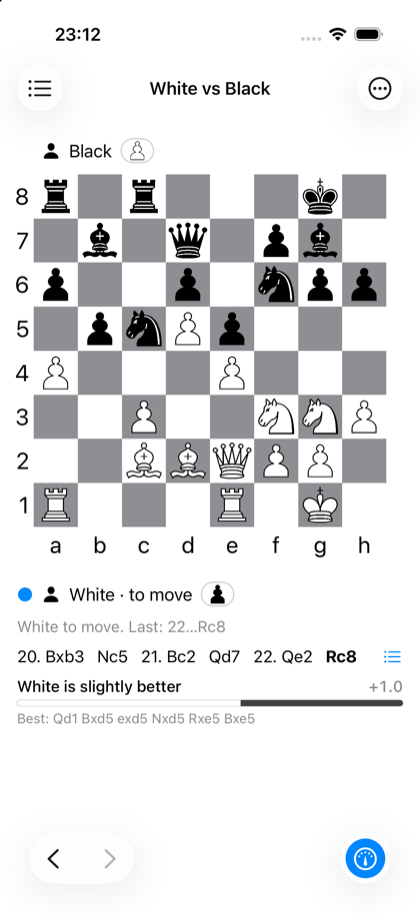
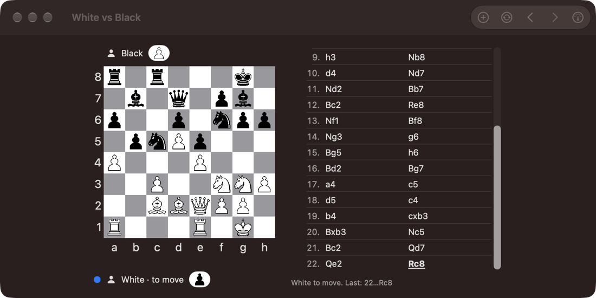

#  BChess

BChess is an open-source chess app for iPhone, iPad and Mac. Its engine is written in C++ with a bitboard representation; the app is written in SwiftUI. A command-line UCI engine, `BChessUCI`, ships from the same code. The app is a work in progress: see what remains to be done below.

<p>
  
  
</p>

## Features

- All the rules of chess, including castling, en passant and promotion. Checkmate, stalemate and draw by threefold repetition end the game.
- Play against the computer or a friend, or watch the computer play itself. The computer thinks for 2, 5, 10 or 15 seconds a move and plays from a small opening book.
- A simple game screen: the board, the two players, one status line and the moves. On iPhone the last moves sit in a strip under the board, and every move, with variations and comments, is one tap away. On the Mac and on iPad in landscape the full move list sits beside the board.
- An Engine button that shows who stands better, the evaluation and the best line, including on your own turn (analysis stops after 10 seconds).
- Back and forward through the game and its variations from the toolbar, or with ← → and ⌘← ⌘→ on the Mac.
- Copy a game (PGN) or a position (FEN), and paste either. On the Mac these are in the Edit menu (⌘C, ⌥⌘C, ⌘V); on iPhone and iPad in the ⋯ menu, with Share.
- On the Mac, Analyze Game and Practice Openings in the Game menu.
- Games are saved as `.bchess` files (JSON). Older `.json` games and PGN files still open; for a PGN file with several games, the Mac's Game menu picks the game.
- On the Mac each game is a document. On iPhone and iPad the app opens on the last game and keeps all games in a Games list, stored in the app's Documents folder (visible in Files), with Import, Share (standard PGN) and delete.
- Light and dark mode.

## Building

Requires Xcode 26 or later. The app targets iOS 18 and macOS 15.

The Xcode project is generated from `project.yml` with [XcodeGen](https://github.com/yonaskolb/XcodeGen); after changing `project.yml`, run `xcodegen generate` and commit the project with it.

| Scheme | What it builds | Tests |
| --- | --- | --- |
| `BChess (iOS)` | iPhone and iPad app | UI test: new game, play e4, the engine replies |
| `BChess (macOS)` | Mac app | Engine tests (GoogleTest cases run as Swift Testing cases) and app-logic tests |
| `BChessUCI` | UCI command-line engine | Covered by a test in the macOS scheme |

```
xcodebuild test -scheme "BChess (macOS)" -destination 'platform=macOS'
xcodebuild test -scheme "BChess (iOS)" -destination 'platform=iOS Simulator,name=iPhone 17 Pro'
```

GitHub Actions (`.github/workflows/ci.yml`) checks that the project matches `project.yml`, runs both test schemes, builds `BChessUCI`, and fails on compiler warnings in the app's own sources or if any engine test case did not run.

How changes are planned and reviewed is described in `AGENTS.md` and `planning/`.

## Layout

- `Shared/Engine/`: the chess engine, in portable C++
- `Shared/Bridge/`: the Objective-C++ bridge between the engine and Swift
- `Shared/`: the game model and the SwiftUI views shared by both apps
- `iOS/`, `macOS/`: each platform's app shell
- `BChess/`: the `BChessUCI` command-line tool
- `BChessTests/`, `BChessUITests/`: tests

## Attributions
- [Magic Move-Bitboard Generation in Computer Chess, Pradyumna Kannan](http://pradu.us/old/Nov27_2008/Buzz/research/magic/Bitboards.pdf)
- [Magic Move-Bitboard Generation Source Code](https://essays.jwatzman.org/essays/chess-move-generation-with-magic-bitboards.html)
- [Chess Evaluation](https://chessprogramming.wikispaces.com/Evaluation)

## What remains to be done

- Wrap saved PGN at 80 characters per line
- Finish the Zobrist hashing unit test with all the scenarios: castling, attack, etc.
- Copy the move history, not just a reference to it, when a game is copied (see the workaround in `FEngineInfo.mm`)
- Handle UCI moves with promotion (for example `e7e8q`)
- Time management in UCI
- Add the 50-move rule
- Add a heuristic that gives a bonus when the king is safely behind its row of pawns after castling
- Add more openings: the opening book names only a few lines, so most games show no opening name
- Finish the transposition table, available today as "Use Transposition Table (Beta)" in the Mac's Settings ([background](http://www.chessbin.com/post/Transposition-Table-and-Zobrist-Hashing), [more](https://chessprogramming.wikispaces.com/Transposition+Table))
- Pick a game from a multi-game PGN file on iPhone and iPad
- [Optimization](https://people.cs.clemson.edu/~dhouse/courses/405/papers/optimize.pdf)
